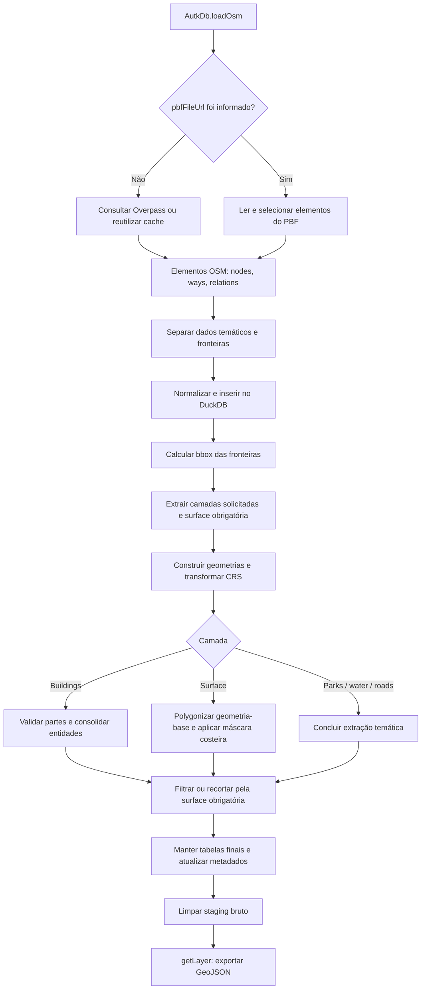
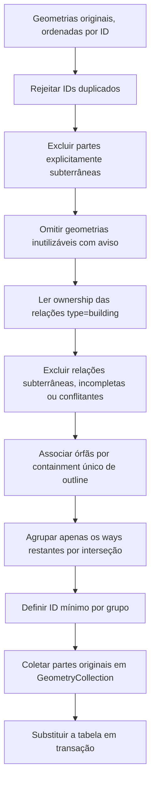

# Importação de dados OSM no Autark

Este documento explica a implementação atual de `AutkDb.loadOsm()`, tanto pela API Overpass quanto por arquivo PBF. Inclui aquisição, representação intermediária, construção de geometrias, relações, agrupamento de edifícios, recorte, exportação e limpeza.

**Referência:** código consolidado no commit `37f8a34`. Os diagramas descrevem o comportamento implementado, não funcionalidades planejadas.

> **Ideia central:** API e PBF têm aquisição diferente, mas convergem para o mesmo modelo de elementos OSM e para o mesmo processamento espacial. Compartilhar o processamento não torna snapshots diferentes ou arquivos incompletos automaticamente equivalentes.

## Índice

1. [Visão geral](#1-visão-geral)
2. [Conceitos e parâmetros](#2-conceitos-e-parâmetros)
3. [Aquisição via Overpass](#3-aquisição-via-overpass)
4. [Aquisição via PBF](#4-aquisição-via-pbf)
5. [Separação e normalização comuns](#5-separação-e-normalização-comuns)
6. [Classificação temática](#6-classificação-temática)
7. [BBox e sistema de coordenadas](#7-bbox-e-sistema-de-coordenadas)
8. [Construção das geometrias dos ways](#8-construção-das-geometrias-dos-ways)
9. [Construção de geometrias de relações](#9-construção-de-geometrias-de-relações)
10. [Consolidação de buildings](#10-consolidação-de-buildings)
11. [Construção da surface](#11-construção-da-surface)
12. [Filtragem e recorte final](#12-filtragem-e-recorte-final)
13. [Exportação e uso pelo mapa](#13-exportação-e-uso-pelo-mapa)
14. [Temporários, erros e limpeza](#14-temporários-erros-e-limpeza)
15. [Paridade entre fontes e diagnóstico](#15-paridade-entre-fontes-e-diagnóstico)
16. [Testes e mapa do código](#16-testes-e-mapa-do-código)

## 1. Visão geral



Se o visualizador não renderizar Mermaid, o fluxo essencial é:

```text
Overpass ── consultas + cache ─────┐
                                 ├─ elementos OSM ── DuckDB ── camadas finais
PBF ── decoder + seleção local ───┘                         │
                                                          └─ GeoJSON ── mapa
```

### As representações ao longo do processo

| Momento | Representação | Exemplo |
|---|---|---|
| Fonte API | JSON Overpass; ways com coordenadas inline | `nodes: [1,2,3,1]`, `geometry: [{lat,lon}, ...]` |
| Fonte PBF | Blocos binários comprimidos | String table, nodes, dense nodes, refs em deltas |
| Após leitura | Objetos `OsmElement` | `{type: 'way', id, tags, nodes, geometry}` |
| Staging bruto | Tabelas DuckDB de elementos | `table_osm`, `table_osm_boundaries` |
| Extração temática | Uma geometria por way selecionado, mais áreas de relações aplicáveis | `table_osm_water` |
| Buildings consolidados | Uma linha por entidade, com partes originais | `GeometryCollection` + `properties.parts` |
| Exportação | `FeatureCollection` | Uma feature por linha armazenada |
| Renderização | Buffers de posições e índices | Extrusão de altura e triangulação fora da importação |

## 2. Conceitos e parâmetros

### Vocabulário OSM

| Conceito | Significado | Não confundir com |
|---|---|---|
| **Node** | ID e coordenadas de um ponto OSM | Um vértice de um mesh GPU |
| **Way** | Sequência ordenada de referências a nodes | Necessariamente um polígono: pode ser uma linha aberta |
| **Relation** | Lista de membros, tipos, roles e tags | Uma geometria pronta ou uma união dos membros |
| **Role** | Papel de um membro, como `outer`, `inner`, `outline`, `part` | Tag temática do way |
| **BBox** | Retângulo que limita uma extensão | A fronteira administrativa real |
| **Surface** | Polígonos construídos a partir das fronteiras solicitadas | Um modelo de elevação ou terreno raster |
| **Building feature** | Entidade armazenada com suas partes | Uma parte isolada ou todos os edifícios que se tocam |
| **Snapshot** | Estado dos dados OSM usado na aquisição | Um conjunto de dados necessariamente igual ao OSM atual |

IDs OSM são separados por tipo: um node e um way podem ter o mesmo número. Por isso, a mesclagem das respostas identifica elementos por **`(type, id)`**, e o staging preserva a coluna `kind`.

### Exemplo pela API

```ts
await db.loadOsm({
  queryArea: {
    geocodeArea: 'New York',
    areas: ['Battery Park City', 'Financial District'],
  },
  outputTableName: 'table_osm',
  forceRefresh: true,
  autoLoadLayers: {
    layers: ['surface', 'parks', 'water', 'roads', 'buildings'],
  },
});
```

### Exemplo por PBF

```ts
await db.loadOsm({
  pbfFileUrl: '/data/lower_mnt.osm.pbf',
  queryArea: {
    geocodeArea: 'New York',
    areas: ['Battery Park City', 'Financial District'],
  },
  outputTableName: 'table_osm',
  autoLoadLayers: {
    layers: ['surface', 'parks', 'water', 'roads', 'buildings'],
  },
});
```

| Parâmetro | Efeito atual |
|---|---|
| `pbfFileUrl` | Escolhe o importador PBF. Sem ele, usa Overpass. Não é fallback automático. |
| `queryArea.geocodeArea` | Escopo de desambiguação nas consultas Overpass. O seletor local PBF não usa esse escopo. |
| `queryArea.areas` | Nomes exatos das relações de fronteira a buscar. |
| `queryArea.bbox` | Alternativa às áreas nomeadas: `[west, south, east, north]` em WGS84, para Overpass ou PBF. |
| `autoLoadLayers.layers` | Camadas públicas extraídas, na ordem informada. Surface sempre é construída; se omitida, fica escondida da listagem de layers. |
| `autoLoadLayers.coordinateFormat` | CRS declarado da entrada; padrão `EPSG:4326`. Não muda o CRS dos dados na fonte. |
| `outputTableName` | Prefixo das tabelas; padrão `table_osm`. |
| `forceRefresh` | Ignora o cache Overpass. Não completa nem atualiza o arquivo PBF. |
| `onProgress` | Recebe fases do carregamento; não é uma porcentagem de progresso. |

O workspace usa `EPSG:3395` por padrão para armazenamento. A API pública usa o workspace corrente; opções internas também recebem seu nome explicitamente.

**Pré-condições:** `db.init()` deve ter sido executado. OSM deve ser carregado antes de camadas não OSM no mesmo workspace, pois estabelece o contexto espacial.

A seleção pública aceita áreas nomeadas ou `queryArea: { bbox: [west, south, east, north] }`, tanto por Overpass quanto por PBF. A bbox é validada antes de HTTP/leitura: quatro coordenadas finitas dentro dos limites WGS84, `west < east` e `south < north`. Cruzamento do antimeridiano não é suportado. O filtro Overpass seleciona candidatos; não promete uma consulta geométrica exaustiva de tudo que intersecta a caixa.

## 3. Aquisição via Overpass

Responsável: [`LoadOsmFromOverpassApiUseCase`](../autk-db/src/use-cases/load-osm-overpass/use-case.ts).

### 3.1 Cache

Antes de consultar o servidor:

1. Procura uma entrada para o escopo, áreas e camadas solicitadas.
2. Se necessário, tenta uma entrada de dados completos como superset.
3. Entradas expiram após **24 horas**.
4. `forceRefresh: true` ignora essas entradas.

O cache usa a Cache API do navegador quando disponível. Chaves atuais têm versão `v3`, para não reutilizar respostas antigas sem coastlines ou relações `type=building`. Bboxes têm chaves próprias por coordenadas e camadas; respostas em cache também incluem os dados necessários à máscara costeira.

> Cache recente não significa dados iguais ao PBF. Pode representar outro momento do OSM, e uma entrada completa reutilizada pode conter mais candidatos que uma consulta temática específica.

### 3.2 Fronteiras primeiro

A consulta identifica o escopo por nome, depois áreas e relações correspondentes aos nomes pedidos. Busca também os ways membros dessas relações.

```text
geocodeArea
    └─ áreas nomeadas
          ├─ relações de fronteira → out body
          └─ ways membros         → out geom qt
```

- `out body` entrega tags e referências de membros da relação.
- `out geom qt` entrega ways com coordenadas inline.
- A bbox utilizada para dividir consultas de buildings é calculada **somente a partir das fronteiras**.
- Parques, água e edifícios não devem ampliar essa bbox de aquisição.
- Para bbox pública, não há consulta administrativa: um way retangular sintético estabelece as fronteiras e a extensão.
- Nos dois casos, uma consulta adicional coleta `natural=coastline` na extensão da área, preservando ways completos e sua direção.

A implementação confere a presença dos nomes solicitados. A identificação por nome não deve ser interpretada como uma validação completa de todas as tags administrativas possíveis.

### 3.3 Consultas temáticas

| Grupo | Aquisição | Observação |
|---|---|---|
| Fronteiras | Uma consulta para áreas nomeadas; sintéticas para bbox | Mesmo sem solicitar a camada `surface` |
| Coastlines | Uma consulta pela extensão da área | Sempre, independentemente das camadas públicas |
| Parks + water | Uma consulta conjunta, com os seletores ativos | Pode solicitar apenas um desses temas |
| Roads | Uma consulta de ways | Relações de roads não são reconstruídas como áreas |
| Buildings | Normalmente quatro consultas, numa grade 2 × 2 | Combina filtro de área com bbox de cada tile |

Com as cinco camadas, sem cache e com extensão disponível, são normalmente **oito consultas de dados para áreas nomeadas**: fronteiras, coastlines, parks/water, roads e quatro tiles de buildings. Para bbox são sete, sem a busca de fronteiras. Consultas de status e retries são adicionais.

Nos tiles de buildings, a relação pode aparecer em mais de uma resposta. A mesclagem remove repetições por `(type, id)`.

### 3.4 Relações e seus membros

Para buildings, as consultas incluem relações com:

- `building` aceito;
- `building:part` aceito;
- **`type=building`**, mesmo sem as duas tags anteriores.

Depois buscam `way(r.dataRelations...)`: os ways membros das relações selecionadas. Esses membros podem não ter tags próprias ou estar fora do tile.

A mesma ideia de coleta de ways membros é usada nas consultas de relações de parks/water. A coleta não equivale a resolver recursivamente qualquer relação aninhada.

### 3.5 Rede, retries e cache do resultado

A implementação:

- usa POST para não depender do tamanho de uma URL;
- consulta o status do Overpass para esperar por slots;
- mantém pausa de 3 segundos entre requisições temáticas;
- tenta novamente após erros de rede e HTTP `429`, `503` e `504`;
- usa backoff com jitter;
- reduz o timeout declarado da consulta após falhas consecutivas de rede/`504`;
- não grava o resultado combinado no cache quando algum grupo solicitado retorna vazio.

Limites declarados das consultas: 128 MiB para fronteiras e 256 MiB para grupos/tiles temáticos. Eles não são o limite `maximum_object_size` do leitor JSON do DuckDB.

Ao final, as respostas são mescladas e seguem para o processamento comum.

## 4. Aquisição via PBF

Responsáveis: [`LoadOsmFromPbfUseCase`](../autk-db/src/use-cases/load-osm-pbf/use-case.ts) e [`osm-pbf-parser.ts`](../autk-db/src/use-cases/load-osm-pbf/osm-pbf-parser.ts).

Para bbox pública, o importador usa diretamente a extensão fornecida e dispensa as fases de descoberta administrativa e cálculo de bbox das fronteiras. A coleta temática existente também conserva coastlines e seus nodes, mesmo sem surface na lista pública. Relações selecionadas mantêm todos os membros disponíveis no arquivo. Coastlines ausentes/incompletas acionam o fallback da surface, não uma busca externa automática.

### 4.1 Decodificação

`@osmix/pbf` lê os blocos do stream. O parser local converte:

| Estrutura PBF | Conversão |
|---|---|
| String table | Índices de strings → nomes/valores de tags e roles |
| Nodes regulares | ID, latitude, longitude e tags |
| Dense nodes | Acumulação dos deltas de IDs/coordenadas e leitura das tags compactadas |
| Ways | Acumulação dos deltas das referências de nodes |
| Relations | Acumulação das referências e associação entre membro, tipo e role |

Um way inicialmente contém referências, não uma geometria pronta. Após coletar os nodes, `resolveWayGeometries()` faz a resolução das coordenadas.

**Limitação importante:** esse resolvedor omite coordenadas de nodes não encontrados; não recupera dados ausentes do arquivo. Portanto, completar referências na origem é essencial, e a leitura de um PBF não deve ser tomada como prova de completude geométrica.

### 4.2 Três fases lógicas — seis leituras do arquivo

Os logs chamam o procedimento de três passes, mas cada fase pode fazer mais de uma leitura do stream:

| Fase lógica | Leituras atuais | Produto |
|---|---:|---|
| 1. Descoberta das fronteiras | 1 | IDs de relações por nome e de seus ways membros |
| 2. Bbox das fronteiras | 2 | Ways da fronteira, depois seus nodes; bbox geográfica |
| 3. Coleta temática | 3 | Relações candidatas, depois ways, depois nodes necessários |
| **Total** | **6** | Elementos selecionados com geometria resolvida |

Cada leitura chama `fetch(pbfFileUrl)` e decodifica o stream. Isso não significa necessariamente seis downloads completos pela rede: a resposta pode vir de cache HTTP. O importador, porém, não guarda sozinho uma única cópia binária para reutilização entre as leituras.

```mermaid
flowchart LR
    A[PBF] --> B[Encontrar fronteiras por nome]
    B --> C[Coletar ways das fronteiras]
    C --> D[Coletar seus nodes e calcular bbox]
    D --> E[Coletar relações temáticas]
    E --> F[Coletar ways temáticos e membros]
    F --> G[Coletar nodes necessários]
    G --> H[Resolver geometry dos ways]
    H --> I[Filtrar e agrupar elementos]
```



### 4.3 Seleção dos candidatos

Primeiro entram relações de fronteira ou relações que correspondem aos temas solicitados. Seus membros do tipo way são registrados.

Depois entram ways que:

1. pertencem à fronteira;
2. pertencem a uma relação candidata; ou
3. correspondem às tags temáticas solicitadas.

Em seguida são coletados os nodes referenciados por esses ways.

A implementação usa filtros probabilísticos `IdFilter` para vários conjuntos de presença. Eles reduzem o custo de rastrear IDs, mas podem ter falsos positivos e conservar candidatos adicionais. Não substituem a validação posterior da geometria ou da identidade de um building.

### 4.4 Filtro espacial e preservação de membros

```text
way candidato
    ├─ é fronteira? → conservar
    └─ sua bbox sobrepõe a bbox das fronteiras? → marcar como intersectante

relação candidata
    ├─ é fronteira? → conservar
    └─ tem algum way membro intersectante? → conservar relação e membros disponíveis
```

Depois são conservados os nodes dos ways retidos.

O teste `wayIntersectsBbox()` compara retângulos de extensão. **Não é um teste exato de interseção geométrica nem de pertencimento ao polígono administrativo.**

O arquivo pode conter todos os membros de uma relação, inclusive os exteriores à área, ou apenas alguns. O importador preserva membros disponíveis; não faz uma consulta Overpass automática para completar os ausentes.

### 4.5 Agrupamento antes do fluxo comum

Os elementos são organizados em fronteiras, parks/water, roads e buildings; esses grupos são mesclados por `(type, id)`.

No agrupamento, fronteiras têm prioridade. Entre temas, buildings vêm antes de roads e parks/water. Nodes necessários acompanham os respectivos grupos.

Por fim, o importador entrega o conjunto combinado ao mesmo `OsmProcessingPipeline` usado pelo Overpass.

**Diferença de escopo:** a descoberta local das fronteiras compara `queryArea.areas` aos nomes presentes no arquivo. Não aplica `geocodeArea`. Um PBF com relações homônimas precisa de atenção adicional.

## 5. Separação e normalização comuns

Responsável: [`OsmProcessingPipeline`](../autk-db/src/internal/process-osm/pipeline.ts).

### 5.1 Separar fronteiras dos dados temáticos

`splitCombinedResponse()` identifica as relações dos nomes solicitados e seus ways/nodes.

| Dataset | Conteúdo |
|---|---|
| `osmData` | Nodes, ways e relações que não são as relações das fronteiras solicitadas |
| `boundariesData` | Ways das fronteiras e seus nodes |

Os ways de fronteira e seus nodes também podem continuar em `osmData`. O que é removido desse dataset são as relações de fronteira identificadas.

Isso não perde necessariamente uma tag temática de um way que também pertence à fronteira.

### 5.2 Uniformizar API e PBF

```text
Overpass: way + nodes[] + geometry[] inline
                    │
                    ├─ emitir registros de nodes pelas coordenadas inline
                    └─ emitir registro do way com refs[]

PBF: nodes reais + way + geometry[] resolvida
                    │
                    ├─ emitir nodes uma única vez por ID
                    └─ emitir registro do way com refs[]
```

Os nodes sintetizados a partir de `geometry[]` mantêm os IDs OSM referenciados pelo way. Não são novos IDs de vértices inventados para o mapa.

### 5.3 Schema do staging bruto

```text
<workspace>.table_osm
<workspace>.table_osm_boundaries
```

| Coluna | Tipo | Uso |
|---|---|---|
| `kind` | `VARCHAR` | `node`, `way` ou `relation` |
| `id` | `BIGINT` | ID OSM no namespace indicado por `kind` |
| `tags` | `MAP(VARCHAR, VARCHAR)` | Tags originais e classificação derivada |
| `refs` | `BIGINT[]` | Nodes de um way ou membros de uma relação |
| `lat`, `lon` | `DOUBLE` | Coordenadas de nodes |
| `ref_roles` | `VARCHAR[]` | Roles dos membros, alinhados com `refs` |
| `ref_types` | `VARCHAR[]` | Tipos dos membros, alinhados com `refs` |

As linhas são serializadas em JSON temporário, registradas no VFS do DuckDB e inseridas no schema. As fronteiras são inseridas com `ignoreTags: true`, pois seu uso é geométrico.

A estrutura bruta **não possui ainda uma coluna `geometry` por elemento**. Essa geometria é construída na extração de cada camada.

## 6. Classificação temática

A classificação adiciona a tag interna `__autk_layer`. Quando um elemento corresponde a mais de uma categoria, a precedência é:

```text
buildings > roads > parks > water
```

| Camada | Critérios resumidos |
|---|---|
| Buildings | `building` ou `building:part` com valor não excluído; ou `type=building` |
| Roads | Possui `highway`, não tem `area=yes` e não está na lista de exclusão |
| Parks | Valores selecionados de `leisure`, `landuse` ou `natural` |
| Water | Valores selecionados de `natural` ou `water` |
| Surface | Ways das fronteiras; não depende de classificação temática |

As listas efetivas estão em [`consts.ts`](../autk-db/src/consts.ts):

| Regra | Valores atuais |
|---|---|
| Parks / `leisure` | `dog_park`, `park`, `playground`, `recreation_ground` |
| Parks / `landuse` | `wood`, `grass`, `forest`, `orchard`, `village_green`, `vineyard`, `cemetery`, `meadow` |
| Parks / `natural` | `wood`, `grass`, `grassland`, `forest`, `scrub`, `heath`, `meadow` |
| Water / `natural` | `water`, `wetland`, `strait`, `spring` |
| Water / `water` | `pond`, `reservoir`, `lagoon`, `stream_pool`, `lake`, `pool`, `canal`, `river` |
| Roads excluídos | `cycleway`, `elevator`, `footway`, `steps`, `pedestrian`, `proposed`, `construction`, `abandoned`, `platform`, `raceway` |
| Buildings excluídos | `shed`, `garage`, `garages`, `carport`, `hut`, `kiosk`, `toilets`, `service`, `transformer_tower`, `sty`, `container` |

Essas regras são específicas do toolkit. Não significam que todo elemento OSM classificado como água, vegetação ou construção será importado.

**Exceção importante para buildings:** ways membros de relações `type=building` entram na extração mesmo sem tags próprias. Assim, a relação consegue fornecer identidade e atributos gerais a partes não classificáveis isoladamente.

## 7. BBox e sistema de coordenadas

Após inserir o staging, `AutkDb.loadOsm()` calcula a bbox da tabela de fronteiras.

```text
nodes das fronteiras em EPSG:4326
        │
        ├─ MIN(lon), MIN(lat)
        └─ MAX(lon), MAX(lat)
                  │
                  └─ transformação para o CRS do workspace, quando necessária
```

Essa bbox estabelece o contexto do workspace quando ele ainda não tem bbox. A rotina atual transforma os dois cantos extremos; não densifica as bordas para calcular a extensão em qualquer projeção arbitrária.

| Conceito | Exemplo | Etapa |
|---|---|---|
| Bbox geográfica de aquisição | Graus, `south/west/north/east` | Tiles Overpass e filtro de candidatos PBF |
| Bbox do workspace | Coordenadas no CRS armazenado | Extração/recorte espacial |
| Surface | Polígono(s) administrativos | Filtragem/recorte final |

Os nomes `minLon` e `minLat` do tipo `BoundingBox` também são usados quando os valores já são X/Y projetados. Não devem ser interpretados automaticamente como graus.

Ways são transformados com `ST_Transform(..., always_xy := true)`. A ordem de entrada é longitude/X, latitude/Y.

## 8. Construção das geometrias dos ways

Responsável: [`LOAD_LAYER_QUERY`](../autk-db/src/use-cases/load-osm-layer/queries.ts).

Para cada camada, a consulta:

1. seleciona seus ways;
2. expande `refs`, preservando o índice de cada referência;
3. encontra os nodes por ID, restringindo a busca a `kind='node'`;
4. cria pontos a partir de longitude/latitude;
5. ordena os pontos pelo índice original do way;
6. constrói linha ou polígono e transforma o CRS.

```text
Way 10: refs = [101, 102, 103, 104, 101]
                    │
                    ▼
(id do way, ref, posição)
(10, 101, 0)
(10, 102, 1)
(10, 103, 2)
(10, 104, 3)
(10, 101, 4)
                    │ join com nodes
                    ▼
pontos ordenados → ST_MakeLine → ST_MakePolygon, quando aplicável
```

| Camada | Geometria inicial |
|---|---|
| Buildings / parks / water | Polygon se a primeira e última referência coincidem e há mais de três refs; caso contrário, LineString |
| Roads | LineString |
| Surface | LineString, mesmo para um way fechado; a polygonização ocorre depois |

As tabelas extraídas inicialmente têm `id`, `properties`, `refs` e `geometry`.

Para parks/water, a bbox fornecida é usada na interseção geométrica durante a extração. Roads/surface são construídas como linhas sem esse mesmo recorte na expressão SQL; o tratamento final pela surface ocorre em etapa posterior.

No fluxo público OSM, **buildings não recebem bbox para cortar suas partes antes da consolidação**.

A montagem por join não é uma certificação geral de completude das referências. Dados de origem incompletos precisam ser investigados; a validação posterior de buildings detecta geometria inutilizável, mas não consegue descobrir toda coordenada ausente se o resultado ainda parecer topologicamente válido.

## 9. Construção de geometrias de relações

Responsável: [`LoadOsmLayerUseCase`](../autk-db/src/use-cases/load-osm-layer/use-case.ts).

### 9.1 Áreas compostas de ways

Parks, water e relações de buildings que não são `type=building` podem gerar geometrias de área.

```text
Relação multipolygon
    ├─ ways outer ── juntar segmentos por endpoints ── anéis exteriores
    └─ ways inner ── juntar segmentos por endpoints ── buracos
                                                        │
                                                        ▼
                                                Polygon / MultiPolygon
```

Os endpoints são comparados pelas referências dos nodes. Segmentos podem ser invertidos para encaixar; o node de junção repetido é removido ao concatenar.

- Role `outer` ou vazia: candidato a anel exterior.
- Role `inner`: candidato a buraco.
- Um anel exterior produz Polygon; vários produzem MultiPolygon.
- Para vários exteriores, a associação de um buraco usa teste de ponto no anel.
- A geometria montada é transformada para o workspace e, quando há bbox, intersectada com ela.

### 9.2 Limites dessa reconstrução

Não há reconstrução genérica recursiva de relações aninhadas. A rotina de área considera membros do tipo way.

Também **não existe aqui uma regra universal de “qualquer membro ausente rejeita toda a relação”**:

- segmentos sem ways/nodes disponíveis são ignorados na montagem dos anéis;
- cadeias que não fecham não viram anéis;
- sem anel exterior, a relação é omitida e contabilizada no aviso;
- um buraco sem exterior correspondente pode ser omitido com aviso;
- se sobrarem anéis fechados, pode existir um resultado parcial.

Isso é diferente da política mais conservadora de ownership de buildings descrita abaixo. Não se deve assumir que uma área de água reconstruída está completa apenas porque gerou um Polygon.

### 9.3 `type=building` é ownership, não multipolygon extra

Uma relação `type=building` é tratada separadamente:

```text
Relação type=building
    ├─ identidade e atributos gerais
    └─ associação dos ways originais

Não gera um segundo polígono sobreposto aos próprios ways.
```

Essa distinção evita armazenar/renderizar uma área adicional que duplica componentes do edifício.

## 10. Consolidação de buildings

Responsável: [`ProcessOsmBuildingsUseCase`](../autk-db/src/internal/process-osm-buildings/use-case.ts).

### 10.1 Ordem das decisões



### 10.2 Validação e omissão

| Situação | Comportamento |
|---|---|
| Parte `location=underground` | Excluída antes de ownership/clustering, com aviso |
| Relação `location=underground` | Relação e membros são excluídos dessa camada |
| Geometria ausente, inválida, vazia ou não Polygon/MultiPolygon | Parte omitida, com aviso; coordenadas não são reparadas |
| Relação com membro ausente/inutilizável | Relação e seus membros são omitidos, evitando building parcial |
| Parte intencionalmente excluída por ser subterrânea | Não é tratada como falha de geometria; os membros de superfície podem permanecer |
| Mesmo way pertencendo a relações distintas | Relações afetadas são omitidas, com aviso; não se escolhe um dono arbitrário |
| IDs duplicados ou falha SQL/transacional | Erro propagado |
| Nested member, role não suportada (incluindo `roof`), roles conflitantes ou relação sem ways | Aviso e omissão da relação e de todos os seus ways diretos; outros edifícios continuam |

Na leitura de ownership, roles aceitas de ways são vazia, `part`, `outline` e `outer`. Membros node, como labels, não viram partes geométricas. Referências repetidas com a mesma role são deduplicadas. Membership inválida é marcada com um motivo para omissão, mantendo todos os IDs dos ways diretos, inclusive os posteriores ao membro inválido. A consolidação registra `console.warn` com o ID da relação e o motivo e impede que seus membros reapareçam como edifícios parciais/independentes. Erros de banco/transação e invariantes internos continuam sendo propagados; não há um catch genérico que esconda falhas da camada inteira.

**Não excluem por si só:** altura zero, `layer` negativo ou `building:levels:underground`. A exclusão específica desta etapa exige `location=underground`.

### 10.3 Ownership explícito

Uma relação pode associar partes desconectadas ou sem tags próprias:

```text
Relação R
    ├─ way A: corpo principal
    ├─ way B: componente do teto
    └─ way C: parte distante

Resultado: uma feature com [A, B, C], sem exigir A ∩ C.
```

Relações distintas permanecem entidades distintas mesmo quando suas geometrias se sobrepõem.

### 10.4 Partes órfãs e inferência conservadora

Uma parte sem ownership explícito pode ser incorporada a uma relação se:

1. tiver `building:part` preenchido e diferente de `no`;
2. sua geometria inteira for coberta por um outline original;
3. os outlines que a cobrem pertencerem a **uma única relação utilizável de superfície**.

O teste é `ST_Covers(outline, part)`: respeita buracos e permite contato com a borda.

São outlines candidatos:

- membros com role `outline`; ou
- membros com role vazia/`outer`, tag `building` preenchida e diferente de `no`, sem indicação ativa de `building:part`.

Não se usam partes comuns ou partes já inferidas como novos outlines.

| Caso | Associação inferida? |
|---|---|
| Parte inteira dentro de um único building | Sim |
| Contato com borda, ainda totalmente coberta | Sim |
| Vários outlines da mesma relação cobrem a parte | Sim, a relação é contada uma vez |
| Dois buildings distintos cobrem a parte | Não; aviso de ambiguidade |
| Apenas sobreposição parcial | Não |
| Parte num buraco do outline | Não |
| Building independente sem tag de parte | Não |
| Parte já pertencente a outra relação | Não se sobrescreve ownership |

A inferência é registrada separadamente em `osmRelation.inferredParts`; os membros originais da relação não são falsificados.

### 10.5 Clustering dos elementos restantes

Ways ainda sem ownership usam `computeIntersectingClusterIds()`:

```text
A intersecta B; B intersecta C
                ↓
         cluster [A, B, C]

Mesmo se A não intersectar C diretamente.
```

É agrupamento por componentes conexos de interseção 2D, com índice espacial. Não considera automaticamente nome, endereço, altura, layer ou identidade cadastral.

**Limitação conhecida:** ways de superfície sem associação explícita ainda podem unir entidades independentes por contatos transitivos. Remover conectores subterrâneos e preservar relações reduz casos demonstrados, mas não prova identidade semântica para todo OSM.

### 10.6 Armazenamento canônico

```text
Antes: uma linha por parte

id   geometria   atributos
10   Polygon A   height=12
20   Polygon B   height=25

Depois: uma linha por building

id=10
building_id=10
geometry=GeometryCollection[A, B]
properties.parts=[
  {id:10, geometryIndex:0, height:12},
  {id:20, geometryIndex:1, height:25}
]
```

O ID é o **menor ID das partes retidas**, inclusive partes inferidas. Não é um índice de cluster ou obrigatoriamente o ID da relação.

As partes são ordenadas por ID. Os índices `geometryIndex` apontam para as geometrias da collection na mesma ordem.

Atributos próprios ficam nas partes. Atributos idênticos em todas as partes podem ser promovidos ao nível do building; tags gerais da relação também são incorporadas. Na resolução para renderização, os atributos da parte têm precedência sobre os gerais, incluindo grupos alternativos de tags de altura/base.

```text
properties.osmRelation
    ├─ id: string
    ├─ members: IDs/roles originais
    ├─ properties: tags originais da relação
    └─ inferredParts: IDs associados por outline-containment, quando houver
```

**Não há união geométrica, convex hull ou coluna persistente `agg_geometry`.** O arquivo temporário de mapeamento contém IDs e atributos, não uma segunda cópia das coordenadas. A collection é construída a partir das geometrias da tabela de origem.

“Preservar a geometria original” aqui significa não unir, recortar ou reparar as partes na consolidação. As coordenadas já passaram pela transformação de CRS necessária ao workspace.

## 11. Construção da surface

Responsável: [`PolygonizeOsmSurfaceUseCase`](../autk-db/src/internal/process-osm-surface/use-case.ts).

```text
table_osm_boundaries
        │ extrair ways como linhas
        ▼
table_osm_surface, inicialmente linear
        │ exportar para GeoJSON
        │ Turf polygonize
        ▼
polígonos fechados
        │ registrar JSON temporário no DuckDB
        ▼
table_osm_surface, substituída por polígonos
```

A polygonização constrói a geometria-base: polígonos administrativos para áreas nomeadas ou um retângulo sintético para bbox. Nos dois casos, [`coastalLandMask`](../autk-db/src/internal/process-osm-surface/coastline.ts) reconstrói a região terrestre na extensão geográfica e a surface final é a interseção dessa máscara com a geometria-base.

A reconstrução preserva a direção OSM (terra à esquerda), recorta segmentos à extensão, divide as bordas nos encontros, polygoniza e classifica faces. Anéis desconectados são organizados por contenção para preservar ilhas e buracos. Somente coordenadas da rede da máscara são quantizadas a `1e-10` graus; coordenadas temáticas/buildings não são alteradas por esse ajuste. Coastline ausente, incompleta, ambígua ou inválida gera `console.warn` e conserva a geometria-base inteira. Assim, uma bbox inteiramente marítima sem coastline também usa o retângulo. Lagos/rios não são subtraídos: permanecem disponíveis para `water`. Erros de rede, leitura e banco não são tratados como fallback costeiro.

| Sem solicitar `surface` | Solicitando `surface` |
|---|---|
| Surface é construída e mantida como máscara interna | Surface é construída e exposta como camada pública |
| Não aparece em `getLayersMetadata()` nem nos timings por layer | Aparece na listagem e nos timings |
| Outras camadas são filtradas/recortadas normalmente | Mesmo recorte/filtragem |

A máscara interna permanece registrada e pode ser inspecionada por `getTablesMetadata()`/`getLayer()`. `workspaceCropLayer` continua apontando para ela para restringir cargas posteriores. **Mudança de comportamento:** omitir surface não desativa mais o clipping final.

A `surface` não mantém necessariamente IDs de ways: sua tabela polygonizada armazena geometria e propriedades dos polígonos resultantes.

## 12. Filtragem e recorte final

Após extrair as camadas e construir a surface obrigatória, `AutkDb.loadOsm()` processa as outras camadas contra ela, independentemente da exposição pública da máscara.

### Dois contratos diferentes

| Camada | Excluir features externas? | Cortar a geometria da feature que cruza a fronteira? |
|---|---:|---:|
| Buildings | Sim | **Não** |
| Parks | Sim | Sim |
| Water | Sim | Sim |
| Roads | Sim | Sim |

```text
Building que atravessa a surface:

       dentro | fora
     ┌────────┼──────┐
     │        │      │
     └────────┼──────┘
              │

Resultado: conservar o building INTEIRO.
```

Para buildings, basta que a collection intersecte alguma geometria da surface. Partes fora da surface podem permanecer quando pertencem ao mesmo building que a intersecta.

Para as outras camadas:

1. removem-se features sem interseção;
2. a geometria é intersectada com a união dos polígonos da surface;
3. removem-se resultados vazios.

Esse caminho usa `ST_MakeValid` e `ST_Union_Agg` na preparação do recorte. Isso **não é a união das partes de buildings**: a consolidação de buildings continua sem união/reparo, e a filtragem deles não altera sua geometria.

Se uma camada já sofreu interseção com a bbox, ela pode passar por um segundo recorte, agora pela surface real.

## 13. Exportação e uso pelo mapa

`db.getLayer()` consulta a tabela e monta uma `FeatureCollection`.

| Elemento | Exportação |
|---|---|
| Linha armazenada | Uma feature |
| `geometry` | Serializada com `ST_AsGeoJSON` |
| `id` | `Feature.id`, quando a tabela fornece esse campo |
| `properties` | Atributos armazenados |
| Tipo de camada | `__autk_layer` na raiz da collection |
| Marker interno no nível da feature | Removido pelo use case de exportação |

A exportação não cria uma segunda representação agrupada: o building já está consolidado no banco.

**CRS:** `getLayer()` exporta as coordenadas armazenadas; não faz automaticamente uma conversão de volta para WGS84. No workspace padrão, o resultado usado pelo mapa tem coordenadas projetadas `EPSG:3395`.

Na renderização, `TriangulatorBuildings` resolve as partes por `geometryIndex`, herda atributos gerais e extruda alturas. Essa extrusão não é uma etapa de importação no DuckDB.

Uma altura ausente pode ter fallback de renderização quando configurado; altura explicitamente zero ou inválida não é substituída silenciosamente por altura aleatória.

Identidades diferentes precisam ser distinguidas:

| Identidade | Exemplo | Significado |
|---|---|---|
| ID OSM de parte | `289386871` | Way original |
| ID OSM da relação | String em `osmRelation.id` | Associação declarada no OSM |
| `Feature.id` / `building_id` | Menor ID retido do grupo | Building armazenado |
| Índice de seleção do mapa | Posição de um componente/feature no carregamento | Não necessariamente um ID OSM |

Para investigar seleção, compare as partes da feature selecionada e seu ownership, não apenas o número exibido pelo picking.

## 14. Temporários, erros e limpeza

### Ciclo de vida das tabelas

| Recurso | Durante a importação | No sucesso |
|---|---|---|
| `table_osm` | Staging bruto temático | Removido |
| `table_osm_boundaries` | Staging das fronteiras | Removido |
| Temporárias SQL de refs/nodes | Auxílio na montagem das camadas | Reutilizadas/substituídas; associadas à conexão DuckDB |
| `table_osm_surface` | Linhas, depois polígonos e máscara costeira | Mantida; escondida das layers públicas quando não solicitada |
| `table_osm_parks`, `_water`, `_roads` | Camadas temáticas | Mantidas |
| `table_osm_buildings` | Partes, depois entities consolidadas | Mantida |
| JSON de mapeamento de buildings | IDs e atributos para consolidar | Arquivo VFS removido em `finally` |

### Garantias e limites

- A substituição da tabela de buildings usa `BEGIN TRANSACTION`, `COMMIT` e `ROLLBACK`.
- A importação completa de todas as camadas **não é uma única transação**.
- Após o importador devolver suas tabelas brutas, `AutkDb.loadOsm()` envolve registro, bbox, extração e recorte em `try/finally`.
- Esse `finally` tenta remover as duas tabelas brutas tanto no sucesso quanto após erro de processamento.
- Se um DROP falha, há aviso; os metadados daquela tabela são mantidos, e a limpeza da outra é tentada.
- A limpeza não remove deliberadamente as camadas finais já criadas e não mascara o erro original de processamento.
- Falhas dentro do importador, **antes de ele retornar as tabelas**, não estão cobertas por esse mesmo `finally`.
- Subprocessos têm seus próprios temporários e estratégias de limpeza. Não existe uma garantia geral de rollback/remoção de todo recurso intermediário para qualquer ponto de falha; por exemplo, a polygonização da surface tem uma sequência própria de DROP, registro e recriação.

### Métricas retornadas

`loadOsm()` retorna contagens de elementos, tempos de processamento e entradas por camada solicitada. A surface interna não solicitada não acrescenta uma entrada aos timings.

A `featureCount` de cada entrada é medida logo após a extração, **antes** do recorte final; para surface, também antes de sua polygonização. Não é necessariamente a contagem final obtida por `getLayer()`.

## 15. Paridade entre fontes e diagnóstico

### O que é comum e o que é diferente

| Aspecto | Overpass | PBF |
|---|---|---|
| Fonte | Resposta remota, normalmente do estado atual | Snapshot contido no arquivo |
| Cache específico | Cache combinado com TTL de 24h | Não usa esse cache; pode haver cache HTTP do arquivo |
| Descoberta do escopo | `geocodeArea` + áreas por nome | Nomes encontrados no arquivo |
| Pré-seleção espacial | Filtros Overpass de área e tiles de buildings | Sobreposição de bbox de ways e retenção de relações/membros |
| Geometria inicial dos ways | Inline na resposta | Resolvida a partir de nodes |
| Membros externos | Ways membros retornados pelas consultas | Somente membros disponíveis no arquivo |
| Normalização e staging | Pipeline comum | Pipeline comum |
| Construção de camadas e CRS | Código comum | Código comum |
| Ownership e consolidação | Código comum | Código comum |
| Recorte e exportação | Código comum | Código comum |

### Condições para igualdade

A comparação deve controlar:

1. mesmo snapshot OSM;
2. mesmas fronteiras, não apenas nomes semelhantes;
3. mesmas camadas, ordem e parâmetros;
4. mesmo CRS de entrada e workspace;
5. referências completas de ways, nodes e relações relevantes;
6. ausência de respostas antigas no cache;
7. equivalência dos candidatos efetivamente adquiridos.

A última condição importa porque os seletores espaciais dos dois importadores não são implementações idênticas. Um teste de bbox local não equivale por definição ao filtro de área do Overpass.

**A garantia exercitada pelos testes atuais é:** para entradas selecionadas equivalentes, as duas representações de fonte passam pela API pública e produzem o mesmo conteúdo de camadas. Isso não é uma certificação de identidade entre qualquer consulta live e qualquer PBF arbitrário.

A comparação de collections deve normalizar a ordem das features quando necessário. `getLayer()` não promete uma ordenação global por ID.

### Dois exemplos investigados

| Sintoma | Causa encontrada | Tratamento |
|---|---|---|
| Seleção de building abrangia entidades diferentes entre API e PBF | Overpass não coletava relações somente `type=building`, perdendo ownership | Seletores agrupados/tiled corrigidos e cache versionado |
| Topo e corpo de um mesmo building separados | Ways `building:part` ausentes da relação, mas contidos no outline | Associação por containment único, com proveniência |
| Área de água menor no PBF | Upper New York Bay, relação `2389632`, com 45 dos 59 ways membros ausentes no arquivo investigado | Não inventar coordenadas; obter um extrato completo/equivalente |

O caso da água é uma observação sobre `gallery/public/data/lower_mnt.osm.pbf`, não uma regra universal de PBF. Um arquivo diferente pode ter todas as referências necessárias.

### Roteiro para investigar uma diferença

```text
1. Comparar parâmetros e origem/snapshot
2. Conferir cache e forceRefresh
3. Comparar relações de fronteira e bbox
4. Comparar elementos por (type, id), tags e membros
5. Conferir completude dos refs dos ways e das relações
6. Comparar geometrias antes de consolidação/recorte
7. Comparar ownership explícito e inferredParts
8. Comparar camadas finais por IDs, partes, geometria e atributos
9. Só então investigar triangulação, picking e renderização
```

Não é suficiente comparar contagens totais ou imagens: duas camadas podem ter a mesma contagem e associar partes a entidades diferentes.

## 16. Testes e mapa do código

### Testes relacionados à importação

| Arquivo | Cobertura relevante |
|---|---|
| [`building-import-pipeline.test.ts`](../autk-db/test/building-import-pipeline.test.ts) | Decoder PBF, fronteiras, bbox, normalização, staging, relações, importação pública, recorte, limpeza e paridade das cinco camadas |
| [`building-model.test.ts`](../autk-db/test/building-model.test.ts) | Consolidação, WKB, atributos, ownership inferido, ambiguidades e exclusão subterrânea |
| [`building-roundtrip.test.ts`](../autk-db/test/building-roundtrip.test.ts) | Import/export/update GeoJSON, IDs e validação de geometrias; é uma rota de importação distinta do OSM |
| [`building-api.test.ts`](../autk-db/test/building-api.test.ts) | API pública e integração de camadas de buildings |
| [`geometry-collection.test.ts`](../autk-db/test/geometry-collection.test.ts) | Predicados e comportamento espacial de collections no DuckDB |
| [`spatial-join-features.test.ts`](../autk-db/test/spatial-join-features.test.ts) | Joins por entidade, preservação de IDs e ausência de matches |

A paridade usa uma fixture sintética comprimida e o snapshot real selecionado do PBF da gallery, reapresentado como relações e ways inline do Overpass. As respostas remotas são adaptadas nos testes; DuckDB, montagem, CRS, consolidação, recorte e exportação são reais.

Isso **não executa uma consulta live completa ao Overpass**, nem valida picking/GPU no navegador.

Comandos na raiz:

```bash
npm test -- autk-db/test/building-import-pipeline.test.ts
npm test -- autk-db/test
make verify
make package-validate
```

Os testes de banco usam DuckDB-WASM em Node e precisam de acesso à extensão spatial. Não presumir execução offline sem provisionamento dessa extensão.

### Onde encontrar cada etapa

| Responsabilidade | Código |
|---|---|
| Orquestração pública, contexto, filtro final e limpeza bruta | [`autk-db/src/db.ts`](../autk-db/src/db.ts): `loadOsm`, `clipLayerToLayer` |
| Consultas, tiles, cache e retries da API | [`load-osm-overpass/use-case.ts`](../autk-db/src/use-cases/load-osm-overpass/use-case.ts) |
| Leituras e seleção do PBF | [`load-osm-pbf/use-case.ts`](../autk-db/src/use-cases/load-osm-pbf/use-case.ts) |
| Decoder de elementos e resolução de ways | [`osm-pbf-parser.ts`](../autk-db/src/use-cases/load-osm-pbf/osm-pbf-parser.ts) |
| Separação, classificação e normalização | [`process-osm/pipeline.ts`](../autk-db/src/internal/process-osm/pipeline.ts) |
| Schema e inserção do staging | [`load-osm-overpass/queries.ts`](../autk-db/src/use-cases/load-osm-overpass/queries.ts) |
| Regras temáticas | [`consts.ts`](../autk-db/src/consts.ts) |
| Bbox das fronteiras | [`get-osm-bbox/`](../autk-db/src/internal/get-osm-bbox/) |
| SQL de extração de ways | [`load-osm-layer/queries.ts`](../autk-db/src/use-cases/load-osm-layer/queries.ts) |
| Configuração por camada | [`osm-processing-config.ts`](../autk-db/src/use-cases/load-osm-layer/osm-processing-config.ts) |
| Montagem de relações e leitura de ownership | [`load-osm-layer/use-case.ts`](../autk-db/src/use-cases/load-osm-layer/use-case.ts) |
| Consolidação e inferência de buildings | [`process-osm-buildings/use-case.ts`](../autk-db/src/internal/process-osm-buildings/use-case.ts) |
| SQL de containment e GeometryCollection | [`process-osm-buildings/queries.ts`](../autk-db/src/internal/process-osm-buildings/queries.ts) |
| Clustering 2D dos ways restantes | [`autk-core/src/utils-geojson.ts`](../autk-core/src/utils-geojson.ts): `computeIntersectingClusterIds` |
| Polygonização da surface | [`process-osm-surface/use-case.ts`](../autk-db/src/internal/process-osm-surface/use-case.ts) |
| Exportação de GeoJSON | [`get-layer/`](../autk-db/src/use-cases/get-layer/) |
| Associação geometria/atributos para renderização | [`autk-core/src/building-feature.ts`](../autk-core/src/building-feature.ts) |

### Resumo dos contratos

- API e PBF convergem para o mesmo processamento depois da aquisição.
- Referências, tipos e roles são essenciais; não basta coletar polygons com tags de building.
- `type=building` fornece ownership e atributos, não uma geometria sobreposta extra.
- Um building armazena suas partes originais numa única feature.
- Partes órfãs só recebem ownership inferido quando a contenção é inequívoca.
- Buildings são filtrados pela surface, mas não cortados.
- Outras camadas podem sofrer recorte e reparo no caminho de clipping.
- Dados ausentes ou snapshots diferentes impedem afirmar paridade absoluta.
- Importação, análise espacial e renderização são etapas distintas.
