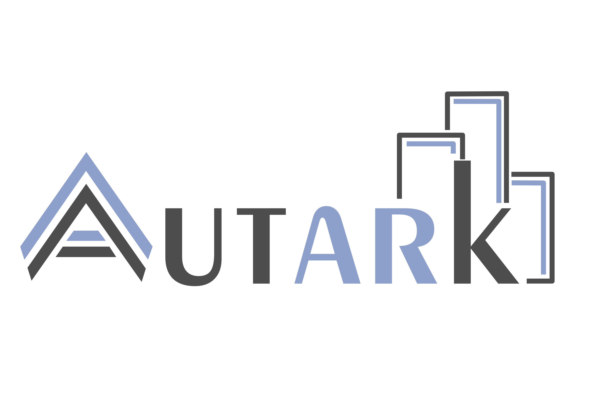

# Autark: A portable UTK-based visualization framework

<div align="center">
  </br>
</div>
<br>

Autark is implemented in TypeScript for lightweight client-side execution with built-in access to OpenStreetMap geometry data for exploring spatial features directly in the browser. It consists of the following sub-projects:

* `autk-db`: A spatial database that handles physical and thematic urban datasets.
* `autk-map`: A 3D map visualization library.
* `autk-plot`: A D3.js/Vega-lite wrapper to build abstract visualizations.

The `example/` directory is included with example codes that can be used for testing or demonstration purposes.

## Requirements

You’ll need Node.js installed to build and run this project. You can install it via [Conda Forge](https://anaconda.org/conda-forge/nodejs) (Windows), [Homebrew](https://brew.sh/) (macOS), [apt-get](https://documentation.ubuntu.com/server/how-to/software/package-management/) (Debian/Ubuntu) or the [official site](https://nodejs.org/). 

To install Node.js:
```bash
# Windows
conda install -c conda-forge nodejs

# macOS
brew install node

# Debian/Ubuntu
sudo apt-get install nodejs
```

## Installing, Running, and Building with Make

### Installation

Install Make (for running predefined build and dev commands):

```bash
# Windows
conda install anaconda::make

# macOS
xcode-select --install

# Debian/Ubuntu
sudo apt-get install build-essential
```

### Building and Running

To install required packages:

```bash
make install
```

To run the development server:

```bash
make dev
```

To clean build artifacts:

```bash
make clean
```

### Publishing packages

Autark is available through **npm** packages. Publishing recently-made changes to **npm** can be done running the commands below.

First, ensure you are logged into your npm account:

```bash
npm login 
```

then, publish the desired module:

```bash
make publish LIB=autk-module 
```

***autk-module*** can assume three values: *autk-map*, *autk-db*, *autk-plot*.


---

## Interaction Controls

You can explore and modify the map using both keyboard and mouse:

### Keyboard Shortcuts

| Key         | Action                                                              |
|-------------|---------------------------------------------------------------------|
| `s`         | Cycle through map styles (`default`, `light`, `dark`)               |


### Mouse Actions

| Action         | Effect                                                            |
|----------------|-------------------------------------------------------------------|
| Double Click   | Select object in the currently active layer (if selectable)       |


---

## Notes

* WebGPU is required to run this project. In Chrome or Edge (v113+), it's enabled by default. In Firefox, WebGPU is only available in Nightly builds and must be explicitly enabled::

  1. Download and install [Firefox Nightly](https://www.mozilla.org/en-US/firefox/channel/desktop/#nightly).
  1. Visit `about:config`.
  2. Set `dom.webgpu.enabled` to `true`.
  3. (Optional) You may also need to enable `gfx.webgpu.enabled` and `gfx.webgpu.force-enabled`.
  4. Restart Firefox.
