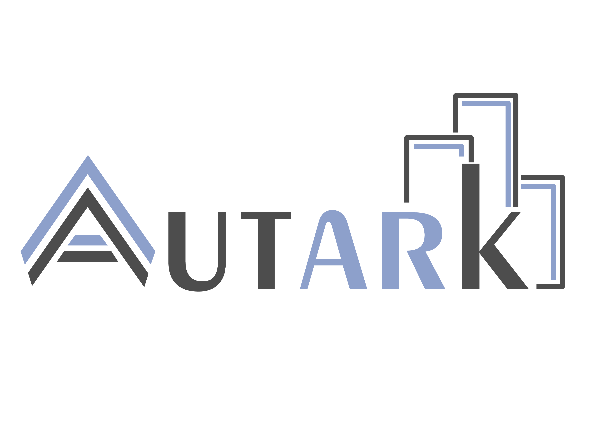

<div align="center">
  </br>

  <h1>Autark</h1>

  <br>
  <p><strong>A serverless, modular toolkit to streamline the prototyping of urban visual analytics systems.</strong></p>

  <p>
    <a href="https://arxiv.org/abs/2604.20759">Paper</a> ·
    <a href="https://autarkjs.org/">Website</a>
  </p>  
</div>
<br>

<p align="center">
  
</p>

<p align="justify">
Autark provides a client-side platform for implementing urban visual analytics software, including WebGPU-accelerated terrain rendering for visualizing elevation-aware urban scenes. It supports loading, storing, querying, joining, and exporting physical and thematic urban data using standard formats such as OpenStreetMap, GeoJSON, and GeoTIFF. By using GPU acceleration, Autark enables sophisticated urban analyses such as shadow and visibility analysis, as well as classic machine learning algorithms such as regression and clustering. Finally, it provides a collection of interactive plots and 2D, 3D, and terrain-aware maps for visualizing urban data.
</p>

Autark is available as a single package or as individual modules:

* `@urban-toolkit/autk`: Complete package that re-exports the toolkit modules, including `@urban-toolkit/autk-core`.
* `@urban-toolkit/autk-core`: Shared low-level core package.
* `@urban-toolkit/autk-db`: A spatial database that handles physical and thematic urban datasets.
* `@urban-toolkit/autk-compute`: A WebGPU-based computation engine for implementing general-purpose algorithms using physical and thematic data.
* `@urban-toolkit/autk-map`: A WebGPU-based vector map visualization library for exploring 2D and 3D physical and thematic layers.
* `@urban-toolkit/autk-plot`: A D3.js-based plot library designed to consume urban data in standard formats and facilitate linked views.

For demonstration and documentation purposes, we created a large collection of examples illustrating the core functionality of each module in the `example/` directory. We also provide more complex examples in the `usecases/` folder.

## Installation

Autark packages are available on npm. Install the complete package when you want the full toolkit:

```bash
npm install @urban-toolkit/autk
```

Or install individual modules when you only need part of the toolkit:

```bash
npm install @urban-toolkit/autk-core
npm install @urban-toolkit/autk-db
npm install @urban-toolkit/autk-compute
npm install @urban-toolkit/autk-plot
npm install @urban-toolkit/autk-map
```

## Development

### Dependencies

CI uses Node.js 22.23.3 and npm 11.15.0. Use those versions to reproduce CI and release checks. Install workspace dependencies with `npm ci`; the root `package-lock.json` is versioned. Use `npm install` only when intentionally updating dependencies, and include the resulting lockfile changes.

TypeScript remains on the latest 6.0 release: TypeDoc and `typescript-eslint` currently declare peer support for TypeScript 6, not 7. Keep this compatibility constraint when refreshing dependencies; do not bypass it with `--force` or `--legacy-peer-deps`. Internal `@urban-toolkit/autk-*` dependency versions remain coordinated with the workspace release.

We also use GNU Make to automate the build process. To install it, please use one of the following commands (we recommend using the package manager [Chocolatey](https://chocolatey.org/) on Windows):

```bash
# Windows
choco install make

# macOS
xcode-select --install

# Debian/Ubuntu
sudo apt-get install build-essential
```

### Tests and verification

Run from the repository root:

```bash
npm test                    # Vitest, package test directories
npm test -- autk-core/test  # one package
make verify                 # lint, tests, typecheck, build and package validation
make package-validate       # build and validate publishable artifacts
npm run pack:packages       # produce local tarballs; never publishes
npm run test:packages       # test those tarballs outside the workspace
```

Package validation rejects mismatched internal dependency versions, local dependency references, and relative `from` references in packed TypeScript declarations that escape the package directory. Published types must reference shared core APIs through `@urban-toolkit/autk-core`, not workspace source paths. Isolated consumer checks install all six tarballs outside the repository, typecheck without `skipLibCheck`, check Node imports and bundle browser imports, including the umbrella subpaths.

Vitest requires a supported Node release (22.14+ within 22.x, 24.x, or 26+). DB integration tests use real DuckDB-WASM in Node and load the spatial extension; extension access is required. CI runs the complete Vitest suite and isolated package checks. Before approving a release, run `npm run test:webgpu --workspace=@urban-toolkit/autk-compute` locally with WebGPU-enabled Chrome and visually check the gallery. The GPU runner reports browser/adapter information and fails if GPU execution is unavailable; CI shader tests do not replace this hardware check. `autk-plot` is covered by isolated package consumption but has no dedicated behavior tests.

### Building and Running

After installing Node.js and GNU Make, run the following command from the project's root folder:

```bash
make dev
```

This command starts a development server for the default `gallery` examples folder. You can also use dedicated shortcuts for each examples workspace, or specify the workspace with `APP` and a specific file with `OPEN`:

```bash
# Run the gallery index
make gallery

# Run the usecases index
make usecases

# Run the gallery with a specific example
make dev APP=gallery OPEN=/src/autk-plot/map-d3-table.html

# Run the usecases workspace (case studies)
make dev APP=usecases OPEN=/src/urbane/main.html
```

### Development Workflow

The `Makefile` provides several commands to help with the development process:

| Command | Description |
| :--- | :--- |
| `make lint` | Runs ESLint. |
| `make typecheck` | Builds package outputs, then typechecks all workspaces. |
| `make build` | Builds the publishable packages and the `autk` umbrella package. |
| `make verify` | Runs lint, tests, typecheck, build and package validation. |
| `make package-validate` | Builds packages and validates the publishable npm artifacts. |
| `make docs` | Generates TypeDoc documentation for the core libraries. |
| `make clean` | Removes `node_modules` and build artifacts, preserving the root lockfile. |

### Releases

Releases are disabled by default. CI only builds, tests and uploads tarballs; it cannot publish. See [the release procedure](.doc/NPM-RELEASE.md) for GitHub environment setup, stage-only npm Trusted Publishers, 2FA approval, recovery and Git tag finalization. The coordinated 4.0.0 release is public on npm and includes PR #114's GPU error handling. Its package integrity/provenance and six Git tags match the tested release commit. Migration notes are in [.doc/RELEASE-4.0.0.md](.doc/RELEASE-4.0.0.md). The coordinated 4.1.0 release candidate and its API/rendering migrations are documented in [.doc/RELEASE-4.1.0.md](.doc/RELEASE-4.1.0.md).

## Notes

Autark requires WebGPU. Please make sure it is enabled in your browser. In Chrome or Edge (v113+), it is enabled by default. In Firefox, WebGPU is only available in Nightly builds and must be explicitly enabled:

  1. Download and install [Firefox Nightly](https://www.mozilla.org/en-US/firefox/channel/desktop/#nightly).
  2. Visit `about:config`.
  3. Set `dom.webgpu.enabled` to `true`.
  4. (Optional) You may also need to enable `gfx.webgpu.enabled` and `gfx.webgpu.force-enabled`.
  5. Restart Firefox.
